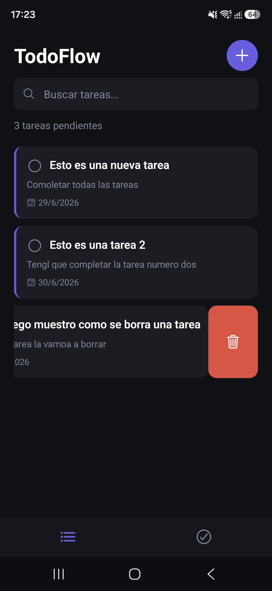
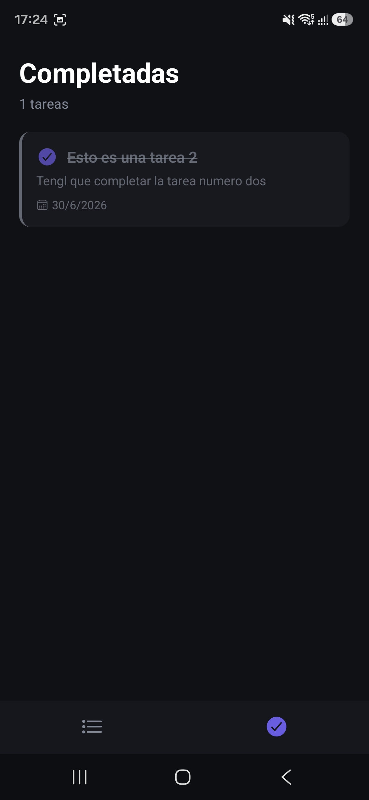

# 📱 TodoFlow

**TodoFlow** es una aplicación móvil nativa desarrollada con **React Native** para la gestión eficiente y fluida de tareas diarias. El enfoque principal de este proyecto es ofrecer una herramienta lígera, reactiva y orientada a la privacidad, procesando toda la información directamente en el dispositivo del usuario sin necesidad de servidores externos ni conexión a internet.

---

| Vista Principal | Tareas Completadas |
|---|---|
|  |  |

---
## 🚀 Caracteristicas Clave
* **Operaciones CRUD Locales:** Flujo completo de creación, lectura, actualización y eliminación de tareas con actualización de estado síncrona.
* **Privacidad por Diseño (100% Offline):** No requiere registro ni conexión a redes; los datos nunca salen del dispositivo.
* **Persistencia de Datos:** Almacenamiento local seguro para mantener la información intacta al cerrar o reiniciar la app.
* **Interfaz Fluida:** Renderizado optimizado con componenetes nativos para una experiencia de usuario limpia y sin lag.

---

## ⚡ Descarga Directa (Instalar en Android)
¿Quieres probar la aplicación de inmediato en tu dispositivo Android sin configurar el entorno de desarollo?
 
👉 **[Descargar la última versión de TodoFlow (APK)](https://github.com/Sergioooxv/TodoFlow/releases/latest)**

*Instrucciones rápidas: Descarga el archivo `.apk` desde el enlace de arriba en tu teléfono, dale permisos para instalar aplicaciones de fuentes desconocidas si tu sistema lo solicita ¡y listo!*

---

## 🛠️ Stack Tecnológico
* **Framework:** React Native
* **Lenguaje:** JavaScript (ES6+)
* **Gestión de Estado:** React Hooks (`useState`, `useEffect`)
* **Almacenamiento:** Async Storage / Native Local Storage
* **Estilos:** StyleSheet (Estrutura nativa optimizada)

---

## 📦 Instalación para Desarrolladores
Si prefieres levantar el entorno de desarrollo en tu máquina local:

1. **Clonar el respositorio:**
```bash
git clone https://github.com/Sergioooxv/todoflow-app.git
cd todoflow-app
```

2. Instalar las dependencias:
```bash
npm install
```

3. Ejecutar el proyecto
   * Para Android:
   ```bash
   npx react-native run-android
   ```
   * Para iOS (requiere macOS):
   ```bash
   npx react-native run-ios
   ```

## 🛡️ Enfoque de Seguridad
Al no depender de APIs externas ni bases de datos en la nube, la superficie de ataque de la aplicación es inexistente. Se mitigan por completo los riesgos de filtración de datos de usuarios, inyecciones en bases de datos o ataques de interceptación de tráfico (MitM).

---

<p align="center">
  <sub>Desarrollado con disciplina por <b>Sergio Salas</b> • 2026<br>
  <i>"El obstáculo es el camino."</i></sub>
</p>

<p align="center">
  <a href="https://github.com/Sergioooxv"></a>
  <a href="https://linkedin.com/in/sergiosalasruiz"></a>
</p>